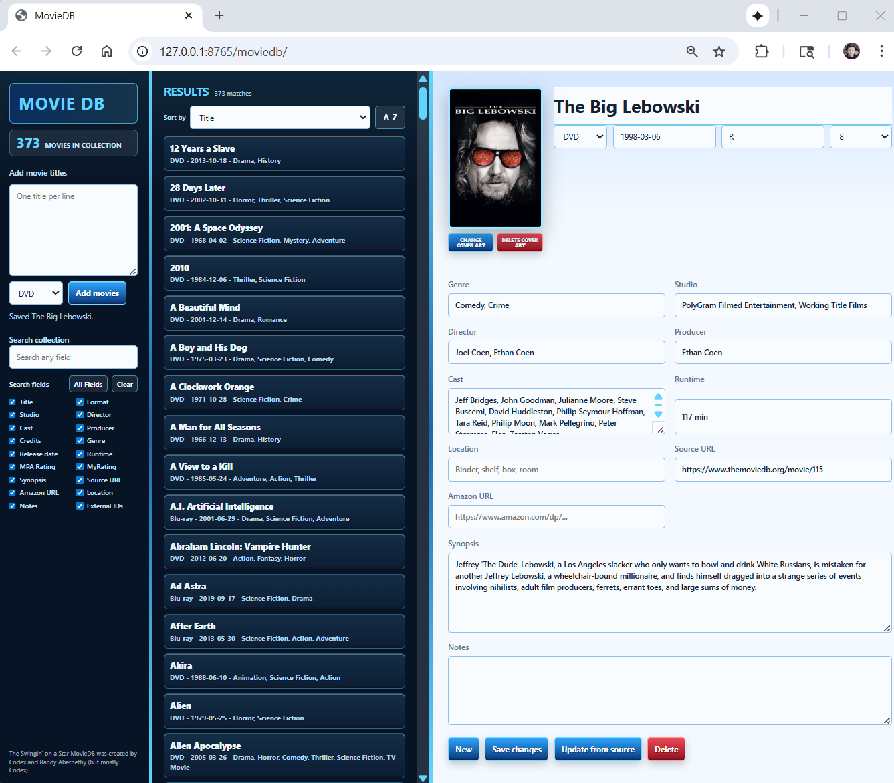

# MovieDB

A movie collection database application written in Go.

The executable runs a local web server (e.g. http://127.0.0.1:8765/moviedb/) and presents a browser based UI via
embedded html/css/js. Movie data is stored locally in a movies.json file under `./data/` with cover art saved in
discrete files under `./data/images/`.

I created this application because I wanted a simple, local solution to manage my movie collection without relying on
external services. I find that once you exceed a few hundred DVD/Blu-ray titles, remembering which movies you have and
where they are becomes challenging. I spend weeks at a time on my sailboat with limited internet access, so online
solutions don't work. Furthermore, once I take the time to enter, and personally rate and record the location of my
movies, I definitely do not want to ever have to do it again! I have tried proprietary, closed source solutions and have
been repeatedly disappointed.

This is why the MovieDB database is simply a JSON file. You can save the movie executable and your data directory in the
cloud and pull it down to any computer you use. If you make changes, you just push the data directory back to the cloud
and then pull it down to any other machines you use the application from. Plain vanilla editors and JSON tools can be
used to manipulate the data directly. While crude, this approach is super simple, supports disconnected operation and is
easy to manage. The JSON file structure also allows the application to evolve over time, adding new fields without
breaking the old DB records. Because the app is just a web server, you can also access it from multiple machines and
tablets on your home network if you like.

The app is compact, about 10MB and a 500 movie database is about 1MB of JSON plus 200MB of cover art (which is
optional) and works great on desk/laptops, good on tablets and decent on phones.


## Build/Run

You can build and run the application on Windows in PowerShell with:

```powershell
go run .
```

The app opens automatically in your default browser.

To build a Windows executable use:

```powershell
go build -o moviedb.exe .
```

To run the executable, just run it!

```powershell
./moviedb.exe
```

By default, MovieDB listens on localhost port `8765`. You can ask the app to listen on all IPv4 interfaces and/or a different port:

```powershell
./moviedb.exe --host 0.0.0.0 --port 8080
```

To listen on specific interfaces, use as many host switches as you require `--host`:

```powershell
./moviedb.exe --host 127.0.0.1 --host 192.168.1.25
```

This is a Go program with a browser based UI so it will need very few (if any) tweaks to run on Linux or Mac, I just
haven't gotten around to it. Most testing is done with Chrome.


## Use

The browser UI has three drag-sizable panes:

- **Add/Search** - automatically add and search for movies
    - You can drop a list of movie titles in the Add box to add in bulk, a dialog provides deconfliction and merge options
    - You can also search for movies by title, genre, year, actor, etc. or multiple fields to find what you are looking for quickly
- **Movie List** - displays a list of movies matching the current search criteria in the Search Pane, sorted by the field and order you choose
- **Movie Details** - shows detailed information about the movie currently selected in the Movie List
    - Allows you to create new movies manually by clicking the "New" button at the bottom of the pane
    - Allows you to edit any field including cover art
    - You can drag/drop or copy/paste cover art to update it or use the COVER ART CHANGE/DELETE buttons
    - To pull fresh data from the internet for a movie, click the "Update from source" button at the bottom of the details pane
    - To delete a movie altogether, click the "Delete" button at the bottom

> N.B. Edits made in the UI are only saved if you click "Save changes"!! This includes creating new movies with "New",
> editing movies, updating Cover Art and updating from the internet with "Update from source". The "Delete" button asks
> you to confirm and persists the change if you confirm immediately. Adding movies automatically in the left pane
> persists movie additions immediately after deconfliction dialogs are answered.


---



---


## Internet data

MovieDB pulls movie cover art and data from the internet into your local database when you use the "Add movie titles"
box in the Add/Search pane. However, most internet sites actively repel automated scraping attempts, so to allow MovieDB
to pull down movie information reliably, you should create an account at one of the online movie database sites and then
and then generate an API key for MovieDB to use.

"The Movie Database" (TMDB) is a popular, user editable database for movies and TV shows and perhaps the best option for
MovieDB. MovieDB can enrich titles with TMDB data if the `TMDB_API_KEY` or `TMDB_BEARER_TOKEN` environment variable is
set. When looking up movie data, MovieDB checks TMDB first if a TMDB key or token is set.

If TMDB settings are not found, MovieDB will check for an Internet Movie Database (IMDB) key in the `OMDB_API_KEY`
environment variable. If found it will use the OMDB API to retrieve data from IMDB.

If no keys are set, MovieDB attempts to load data from public Wikidata and Wikipedia data. This almost always fails
these days due to anti-scrape and rate limiting but you can always enter your own data and cover art manually.

To set keys in PowerShell:

```powershell
$env:TMDB_API_KEY="your_tmdb_v3_api_key"
./moviedb.exe
```

or:

```powershell
$env:OMDB_API_KEY="your_omdb_api_key"
./moviedb.exe
```


### Amazon

You can paste Amazon product URLs into the add box as well, one per line, and MovieDB will make a best-effort scrape of
the public product page for the title, cover image, description, and ASIN. Amazon scraping is intentionally best-effort
because Amazon often blocks or changes automated page access.

Plain title imports do not search Amazon by default. To opt in to Amazon search scraping for plain titles:

```powershell
$env:MOVIEDB_AMAZON_SEARCH="1"
./moviedb.exe
```


## Duplicates

MovieDB does not allow duplicate movies, but it does allow movies with the same title if their release dates differ. On
startup it scans the local database and merges duplicates title/date movies automatically, randomly choosing between
conflicting populated fields (duplicates should not happen but if they do this startup check will repair your DB so that
you can continue to use the app). During import, duplicate matches produce a dialog that lets you cancel, merge new data
into the existing record, merge old data into the new record, or overwrite the old record. If you have concerns about
your database, make a backup of the ./data/movies.json file. You can always restore a backup by shutting down the
application and then just copying over the old movies.json file with your backup. Also, because movies.json is just a
json file, you can edit it manually if needed with any decent editor (e.g. notepad++, vscode, vim, etc.).
